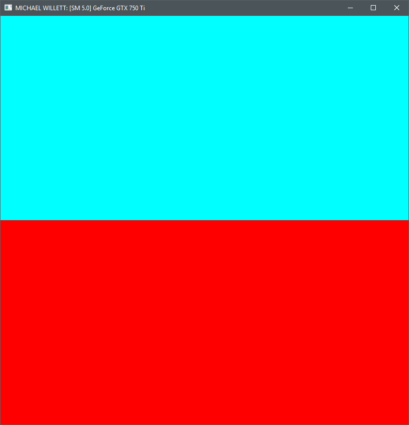
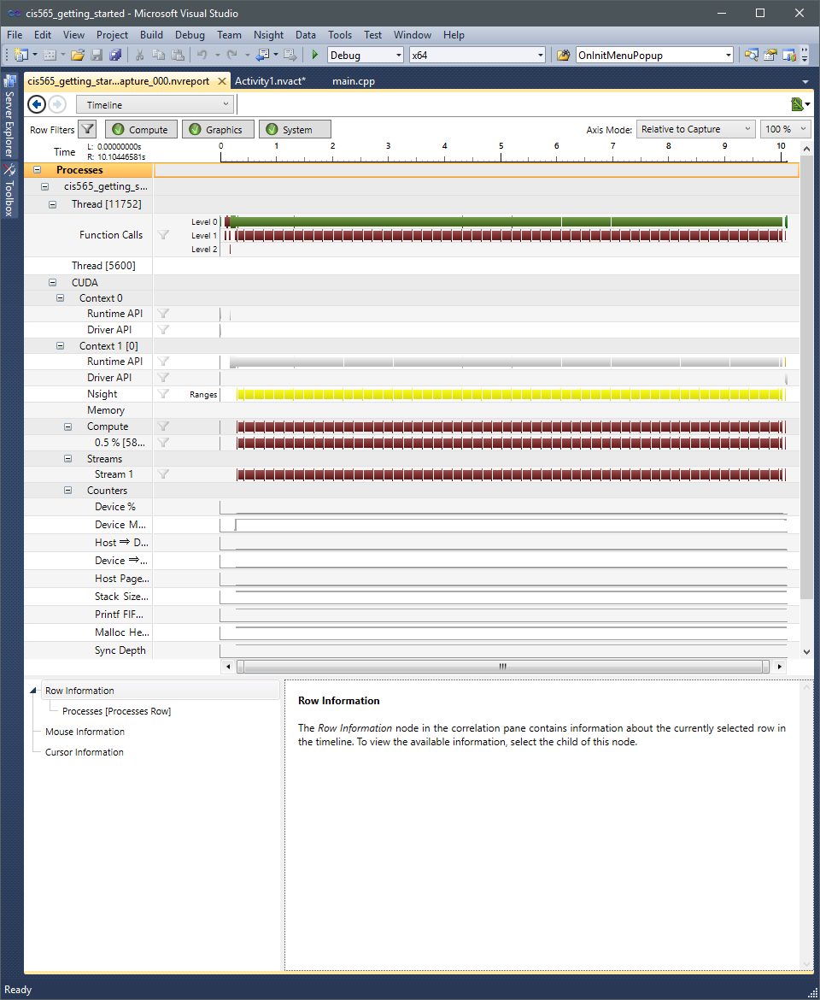

Project 0 CUDA Getting Started
====================

**University of Pennsylvania, CIS 565: GPU Programming and Architecture, Project 0**

* Michael Willett
* Tested on: Windows 10, I5-4690k @ 3.50GHz 8.00GB, GTX 750-TI 2GB (Personal Computer)

### Test Images

Sample Image

NSight Diagnostics
